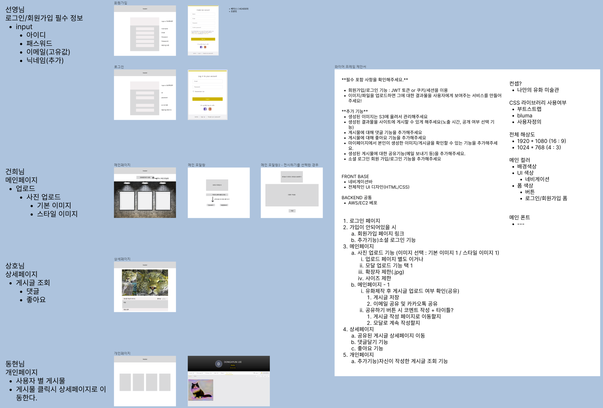
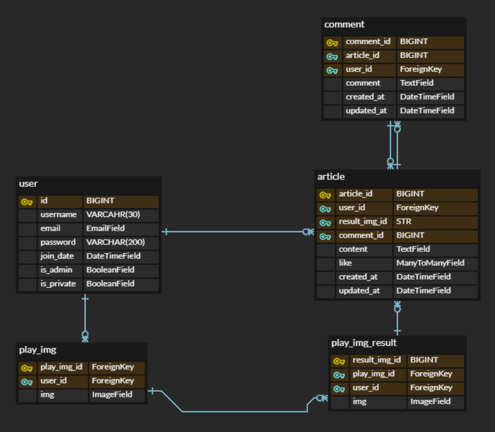
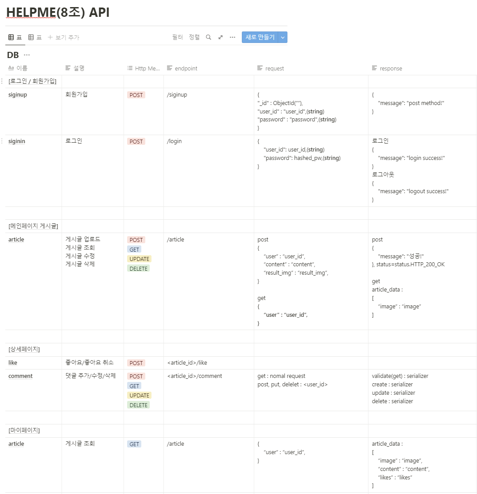

## HELPME team S.A(Starting Assignment)

<!--  팀 이미지  -->

### 🔗 시연 영상
url 

### 🏠 소개
'사용자들이 만든 유화를 전시하는 온라인 미술관'

### ⏲️ 개발기간
2022년 06월 28일 ~ 2022년 07월 05일

### 🧙 맴버구성
- Backend - https://github.com/sparta-camp-helpme/ai_museum_backend/
  - frontend 개발 별도 - https://github.com/sparta-camp-helpme/ai_museum_frontend
  - 김성호 : 상세페이지
  - 백선영 : 로그인/회원가입 필수 정보
  - 이동현 : 개인페이지 / 딥러닝
  - 한건희 : 메인페이지

### 📌 필수 기능
- [ ] Django Rest Framework를 사용해서  프로젝트를 진행해주세요.
    - 프론트엔드와 백엔드를 별도의 레포지토리로 관리해주세요.
- [ ] 회원가입/로그인 기능
    - JWT 토큰 or 쿠키/세션을 이용해서 만들어주세요. (가능하면 JWT로!)
- [ ] 유화제작 인공지능 기술 (NST) 을 사용해서, 사용자가 이미지를 넣으면 유화 스타일이 적용된 이미지로 변환되어 출력되는 서비스를 만들어주세요.
    - 이미지 생성 기술 (Generative models) 을 이용해서, 사용자가 흥미를 느낄 수 있는 서비스 (유화제작, deepfake, 등)를 만들어주세요.
- [ ] 이미지/파일을 업로드하면 그에 대한 결과물을 사용자에게 보여주는 서비스를 만들어 주세요!
- [ ] 프론트엔드는 HTML, CSS, Javascript, Bootstrap, jQuery… 등 자유롭게 스택을 골라서 써주세요.
- [ ] AWS EC2를 사용해서 배포해주세요
    - 프론트엔드는 별도의 배포가 필요합니다.

### 📌 추가 기능
- [ ] 생성된 이미지는 S3에 올려서 관리해주세요
- [ ] 생성된 결과물을 사이트에 게시할 수 있게 해주세요(노출 시간, 공개 여부 선택 기능)
- [ ] 게시물에 대해 댓글 기능을 추가해주세요
- [ ] 게시물에 대해 좋아요 기능을 추가해주세요
- [ ] 마이페이지에서 본인이 생성한 이미지/게시글을 확인할 수 있는 기능을 추가해주세요.
- [ ] 생성된 게시물에 대한 공유기능(메일 보내기 등)을 추가해주세요.
- [ ] 소셜 로그인 회원 가입/로그인 기능을 추가해주세요

### 📌 와이어 프레임
주소 : https://www.figma.com/file/KMId36OyYKTOWDWezd0lrT/%EC%99%80%EC%9D%B4%EC%96%B4%ED%94%84%EB%A0%88%EC%9E%84?node-id=0%3A1  

  
1차 와이어 프레임

  

### 📌 DB 설계
주소 : https://www.erdcloud.com/d/PTtFcJc9CGDeeKjkf  

  
1차 DB

  

### 📌 API 설계
주소 : https://www.notion.so/HELPME-8-API-42b8f1b477254e8da951f9cce09da00d  

  
1차 API

  

### 📌 일정
6 / 28 : 기획 & 목업(S.A) / backend : PROJECT 생성, APP 생성, MODEL 구성, gitignore 생성, requirement.txt 생성 / GIT : BRANCH 역할마다 생성, pull 받기  
6 / 29 : S.A 피드백 / 1차 backend : 팀원별 맡은 담당 기능에 대한 사전조사 및 api 설계   / frontend : html/css 폼 구성  
6 / 30 : 2차 backend : 팀원별 맡은 담당 기능에 대한 사전조사 및 api 설계 / frontend : 모달, 이미지 업로드 등 input 폼 구성 / 1차 중간점검  
7 / 01 : 3차 backend : 팀원별 맡은 담당 기능에 대한 사전조사 및 api 설계 / frontend : 모달, 이미지 업로드 등 input 폼 구성 / 2차 중간점검 
7 / 02 : 1, 2차에 대한 보충  
7 / 03 : 1, 2차에 대한 보충
7 / 04 : 최종점검 병합, 리펙토링, GIT 정리  
7 / 05 : GIT 정리 & 발표 영상 녹화 & 제출 (오후 9시)  

